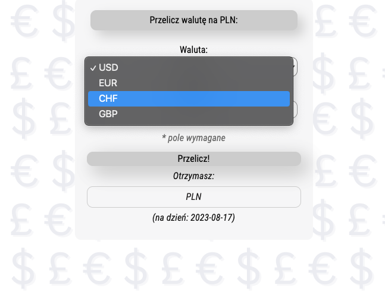
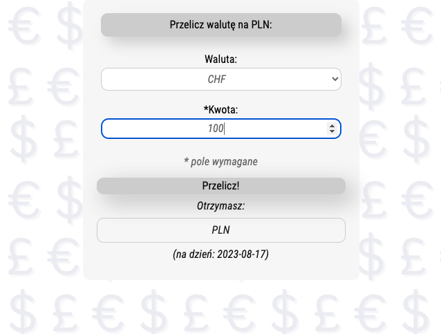
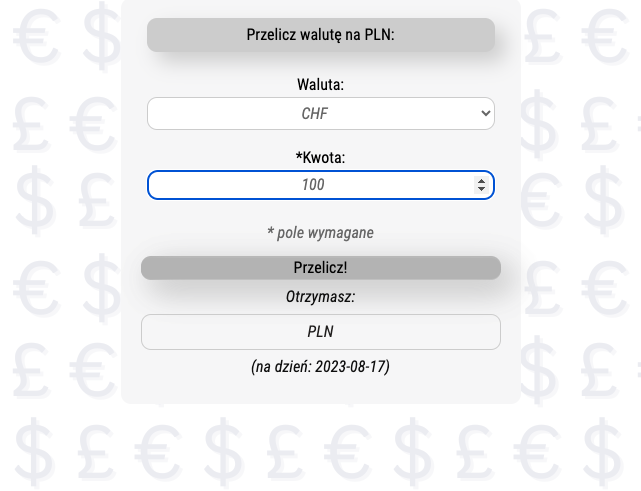
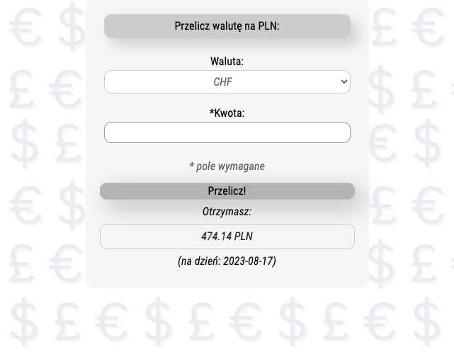

# currency-converter
[link to the page](https://dor-ka.github.io/currency-converter/)

## General info:
This project is a simple currency converter created for practising basic skills.
## Technologies used:
- HTML
- CSS
- JavaScript ES6+ features
- BEM
